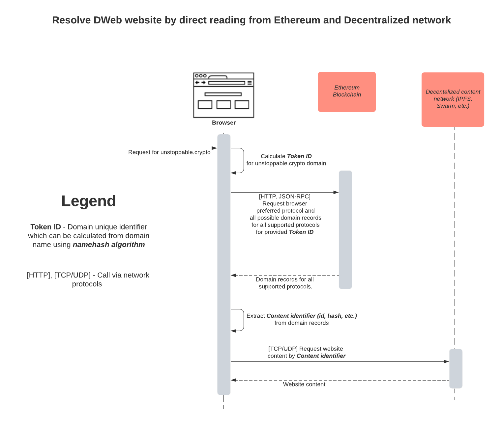
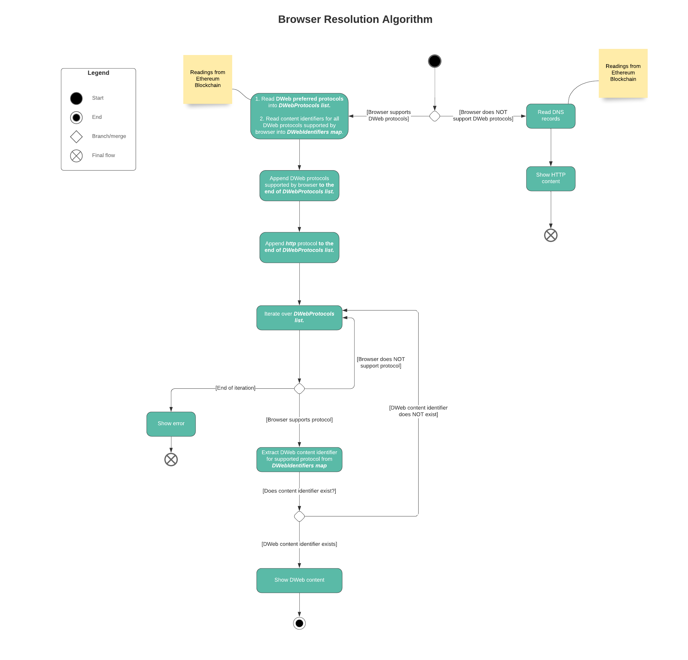

# Browser Resolution Algorithm

This section explains how different domain record configurations should be interpreted by browsers.

A browser can select a protocol it has a support for. If a domain is configured for multiple protocols, it should prioritize a protocol based on `browser.preferred_protocols` record that can be set to a list of the defined protocols.

If `browser.preferred_protocols` is not set, a browser should use the following value as a default `["bzz", "ipfs", "https", "http", "ftp"]`. If `browser.preferred_protocols` is set but is not complete a browser should fullfill the absent protocols at the end in the default order specified above. A domain can have a single content identifier for each distributed protocol stored in `dweb.<protocol>.hash`. Ex: `dweb.bzz.hash` for Swarm's `bzz` protocol. See [Dweb Records](../browser-resolution/browser-resolution-algorithm.md#distributed-web-records) for more information.

If none of `dweb` hash records is set, a browser should fall back to DNS resolution that is set within `dns.*` namespace.

Generally browsers automatically add `http://` prefix for any domain in the address bar if the protocol is not specified explicitly by a user. In case of blockchain domain names \(assuming a browser supports many protocols\), it is preferred to determine a protocol only after resolving domain records.

## Records related to browser resolution

All records related to browser resolution are stored within these namespaces:

* `dns.*` - for traditional DNS records
* `dweb.*` - for distributed content records
* `browser.*` - hint records to help browser determine a preferred content display method

If you are looking for a way to get records associated to a domain, see [Resolving Domain Records](../domain-registry-essentials/resolving-domain-records.md).

### DNS records

Resolver records may contain classical DNS records besides other records. In order to distinguish those from other crypto records, the `dns.*` namespace is used. So DNS `A` corresponds to `dns.A` crypto record. Any [listed DNS record](https://en.wikipedia.org/wiki/List_of_DNS_record_types) described in RFC standards is supported. All record names must follow upper case naming convention.

As crypto resolver doesn't support multiple records with the same key, but DNS does allow that. Therefore, DNS record value must always be stored as [JSON](http://json.org/) serialized array of strings. Example 1: a domain that needs one `CNAME` record set to `example.com.` must be configured as one crypto record `dns.CNAME` set to `["example.com."]`. Example 2: a domain that needs two `A` records set to `10.0.0.1` and `10.0.0.2` must be configured as one crypto record `dns.A` set to `["10.0.0.1","10.0.0.2"]`.

No other data transformation is required when converting a traditional DNS record into Crypto record other than aggregating records with the same name to one record using serialization as JSON array of strings.

Crypto records do not have a domain name associated to them. That is why there is no feature of storing your subdomain records inside a parent domain. Example: `www.example.com` record can only be set inside a resolver of `www.example.com` but never inside `example.com`.

A recommended way to display content in a browser for crypto domains is explained in [Resolving Domains in a Browser](resolving-domains-in-a-browser.md).

#### **TTL**

Records TTL can be set for all records or for individual type of record. TTL for all records can be set in `dns.ttl`. TTL for individual record type can be set in `dns.<RECORD>.ttl`. If `ttl` for individual record type is not set, a default `dns.ttl` need to be applied.

Example crypto records setup:

| Record | Value |
| :--- | :--- |
| dns.A | \["10.0.0.1", "10.0.0.2"\] |
| dns.A.ttl | 168 |
| dns.AAAA | \["2a00:1450:401b:805::200e"\] |
| dns.MX | \["10 aspmx.example.com."\] |
| dns.ttl | 128 |

Should be transformed into the following DNS records:

| Record | Value | TTL |
| :--- | :--- | :--- |
| A | 10.0.0.1 | 168 |
| A | 10.0.0.2 | 168 |
| AAAA | 2a00:1450:401b:805::200e | 128 |
| MX | 10 aspmx.example.com. | 128 |

TTL for individual records of the same type is currently unsupported due to the necessity to change the record value format and increased gas cost. Setting `dns.ttl` instead of TTL for individual records is recommended due to higher gas efficiency.

#### **Authority responses**

It is a common practice in DNS to have an authority of a subdomain delegated to a parent domain. This mechanism is not necessary for crypto domains because the cost of subdomain registration is comparable to setting records. In other words, configuring subdomain using the parent domain has no benefit and may result in even higher gas cost due to the necessity to store associated subdomain name to each record.

Therefore, authority configurations are not supported by crypto domains at the moment.

### Distributed Web records

Distributed Web \(Dweb\) records are designed to allow one to configure a domain for distributed websites protocols like IPFS or Swarm. Such records are stored in `dweb.*` namespace. Each protocol has its own sub-namespace for its data using canonic name. Example: Swarm's protocol canonic name is `bzz` so its records are stored at `dns.bzz.*` namespace.

Record structure can be different based on the protocol. However, all protocols have a common `.hash` record used to reference a content in the distributed network. Example: `dns.ipfs.hash` for IPFS protocol.

See [Resolving Domains in a Browser](resolving-domains-in-a-browser.md) for an information how to interpret those records.

### Legacy Records Support

As of Q3 2020, most .crypto domains are configured using legacy record names for IPFS hash and redirect domain:

1. `ipfs.html.value` deprecated in favor of `dweb.ipfs.hash`
2. `ipfs.redirect_domain` deprecated in favor of `browser.redirect_url`

Browsers are strongly recommended to support those records as a fallback when corresponding replacement records are not set.

