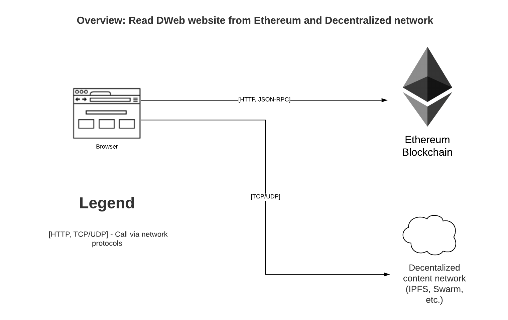
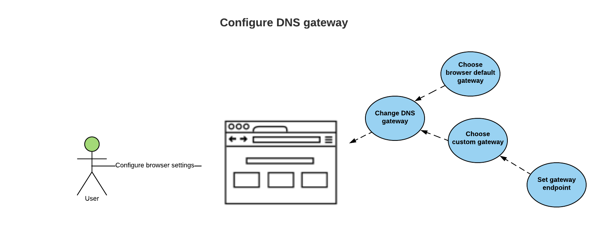
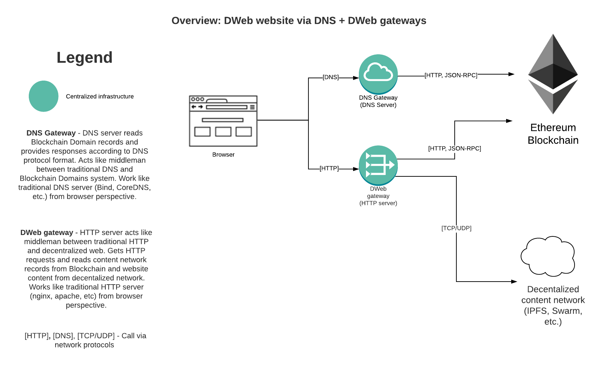
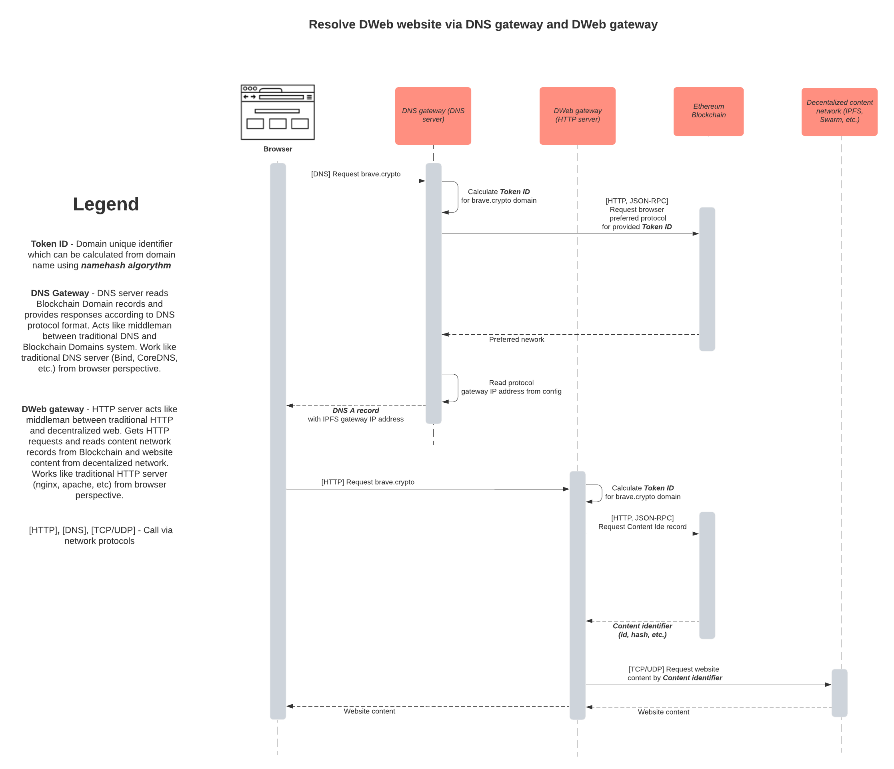

# Resolving Domains in a Browser

This document describes the recommended way to resolve blockchain domains within a classical HTTP Web Browser or a Dapp Browser. The document assumes that a reader has a basic understanding of Unstoppable domains resolution in general. See [Resolving Domain Records](../domain-registry-essentials/resolving-domain-records.md).

## End user features

Here are some of the end user scenarios that should give an idea which features should be available in a browser supporting crypto domains.

### HTTP Website Browsing

1. Given a blockchain domain has a DNS record configured.
2. When user enters the domain name into a browser address bar.
3. Then the browser resolves the domain and gets the specified DNS records.
4. Then the browser requests and displays the content using DNS protocol and HTTP protocol.

### Distributed Website Browsing

1. Given a blockchain domain has an dweb content identifier record configured \(e.g. IPFS hash\).
2. When user enters the domain name into a browser address bar.
3. Then the browser resolves the domain and gets the content hash of a domain.
4. Then the browser retrieves the content by the hash using a related protocol and displays the content

### Domain Level Redirect

1. Given a blockchain domain has a redirect url and IPFS hash configured, and a user's browser doesn't support IPFS protocol.
2. When the user enters the domain name into a browser address bar.
3. Then the browser resolves the domain and gets redirect url and IPFS hash records.
4. Then the browser redirects a user to the redirect URL because IPFS protocol is not supported.

### Resolution Configuration

1. Given a user that want to change its ETH provider service.
2. When user goes to browser settings crypto domains section.
3. User changes ethereum node URL from default to any other.
4. User changes Registry Address for each support crypto registry.
5. User changes network for ethereum node.
6. User changes DNS gateway
7. User changes Dweb gateway
8. Then the browser uses new settings to make requests to ethereum blockchain
9. If network is not specified explicitly, it can be retrieved from the ethereum node URL.
10. If Registry Address is not specified, it can use a default for specified network

## Content Display Protocol

In addition to base browser content display protocol like `http` blockchain domains can also be configured for distributed content protocol like `ipfs`. Here is the list of content display protocols that can be associated with a crypto domain:

* Traditional
  * HTTP
  * HTTPS
  * FTP
* Distributed
  * [IPFS](https://en.wikipedia.org/wiki/InterPlanetary_File_System) defining `ipfs://` protocol
  * [Swarm](https://swarm-guide.readthedocs.io/en/stable/architecture.html#the-bzz-protocol) defining `bzz://` protocol

A browser may support any subset of traditional or distributed protocols that would still make crypto domains websites displayable.

## Gateway to simplify the integration

While it is possible to make resolve a domain via a call to ETH RPC and support distributed content protocols in a browser, it might be easier to make those call via gateways using protocols already supported by all browsers: HTTP and DNS. A gateway may simplify the integration to a browser, but comes at the downside of decreased decentralization \(if gateway is hosted by third party\) or complex user experience if the gateway is hosted by the user.

There are 2 possible gateways for each of the problem:

* Distributed content \(Dweb\) gateway
* Resolution over DNS gateway

See a description of how they work below

### Distributed content gateway

A gateway is an HTTP Server that acts as a proxy between HTTP and distributed content protocol. Basic functionality of such a gateway:

1. Receive HTTP request to crypto domain \(like `http://example.crypto`\)
2. Resolve a domain into crypto records
3. Get the content based on [Browser Resolution Algorithm](browser-resolution-algorithm.md)
4. Return the content to client via HTTP

### Resolution over DNS gateway

A gateway is a DNS Server that resolves not just traditional domains but also `.crypto` domains. Basic functionality of such a gateway:

1. Receive a domain resolution request
2. Resolve a domain using classical DNS system if is in classical TLD \(like `.com`\)
3. Resolve a domain using [Browser Resolution Algorithm](browser-resolution-algorithm.md) if it is in crypto TLD
   * If a domain is set using DNS, transform [crypto DNS records](../managing-domains/managing-domain-records.md#dns-records) into classical records
   * If a domain is set using distributed content
     * If client requests `A` record, resolve to [Distributed Content Gateway](browser-resolution-algorithm.md#distributed-content-gateway) IP Address
     * If client requests `TXT` record, resolve to all crypto records in JSON encoded key-value format
4. Send resolution to client

