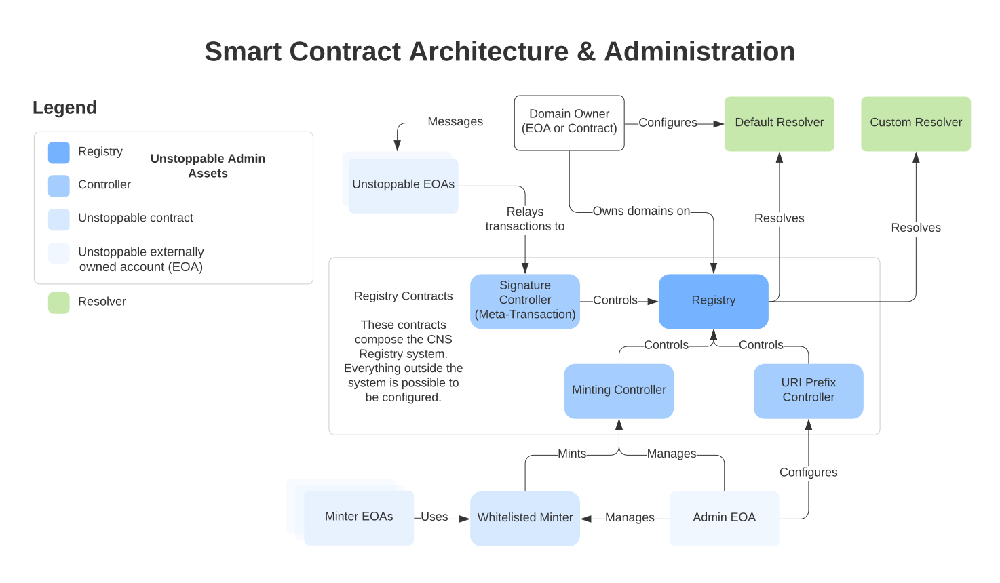

# Architecture Overview

This section introduces the basic principles of CNS - Crypto Name Service. We don't attempt to give a deep technical explanation of them, but rather make a high-level overview so that every reader can get an idea of how CNS works. It is assumed that a reader has a basic understanding of Ethereum smart contracts and [ERC-721 token standard](https://eips.ethereum.org/EIPS/eip-721).

This section covers the following topics:

* [Smart Contract Architecture](architecture-overview.md#smart-contract-architecture). It gives an overview of the core smart contracts of CNS, explains how domains are managed and minted, what information about them is stored, and how users can interact with them via blockchain.
* [Domain Hierarchy and Ownership](architecture-overview.md#domain-hierarchy-and-ownership) describes how subdomains are managed.
* [Delegating Domain Management](architecture-overview.md#delegating-domain-management) explains the role of Transaction Processor and meta transactions in minting domains and allowing users to delegate the responsibility of paying transaction costs.

Unstoppable Domains are powered by CNS. It is built on Ethereum blockchain, and at its core, it's a set of smart contracts governing domains. Serving a similar purpose as DNS, CNS has a lot of architectural differences that change the way how users interact with domains: while providing decentralized access, it also grants users permanent domain ownership. Unlike other services, the CNS registry doesn't have the concept of renewing domains or revoking them, thus granting users full control of their second-level domains.

Every CNS domain represents an [ERC-721](https://eips.ethereum.org/EIPS/eip-721) token. As this standard is widely supported, it makes it easier for developers to integrate with Unstoppable Domains, and users get an immediate benefit of being able to manage ownership of their domains from any wallet, exchange, or marketplace that supports ERC-721.

## Smart Contract Architecture

The two central components of CNS are Registry and Resolver smart contracts. Resolver can be thought of as a _map_ \(or _dictionary_\) of domain names to a set of records, and Registry - as a _map_ of domain names to an owner address and a Resolver address.

There's only one official instance of the Registry smart contract deployed in the Ethereum Mainnet, but there are many versions of Resolver smart contracts. The relationship between Registry and Resolver can be described as follows: Registry stores many domains, and each domain has a Resolver address record. This assumes that every domain might have a different resolver, though in practice majority of domains is managed by the same instance \(having the same address\) of the latest version of Resolver smart contract.


Updates to our Resolver smart contract are incremental and non-breaking, meaning that we add new features without disrupting the work of existing domains that haven't got updated. Any Resolver smart contract must implement [IResolver interface](https://github.com/unstoppabledomains/dot-crypto/blob/master/contracts/IResolver.sol), which defines the basic set of functionality and guarantees compatibility between different implementations.


As mentioned, every domain represents an ERC-721 non-fungible token. Every ERC-721 token is identified by a unique number, which is called a token identifier. To make domains identifiable, we use a process called [Namehashing](namehashing.md). This process is irreversible: one can calculate a namehash of a domain having its name, but it's impossible to restore a domain name from a namehash.

Here's an example of "example.crypto" namehash: `0xd584c5509c6788ad9d9491be8ba8b4422d05caf62674a98fbf8a9988eeadfb7e`

### Visualization

Here is a map to help visualize how the CNS Registry and Resolvers interact.

### Registry

Registry is the most essential smart contract in CNS. This is the contract that defines ownership rules, how domains are minted, provides ERC-721 token metadata, and stores a list of all domains with information about them.

Registry stores the following data about each domain:

* Owner address
* Approved operator address
* Resolver address
* Domain name


As domains are identified by a namehash, we also store a domain name, apart from the other data. As it's impossible to calculate a domain name from its identifier, it allows users, that know only a namehash, lookup a real domain name.


Registry smart contract implements a set of methods allowing to mint new domains, subdomains, and manage ownership.

Accounts that are allowed to mint second-level domains \(like 'alice.crypto'\) are called whitelisted minters. Whitelisted minters are limited to only minting new domains. They can't control domain ownership \(e.g. approve or transfer a domain to another owner\) and they can't control domain records. Whitelisted minters are operated by Unstoppable Domains.

A domain owner or an operator may perform the following operations with their domains:

* Transfer ownership
* Set a new resolver
* Mint a new subdomain
* Burn a domain

Users can set one trusted operator per owned domain and one operator for their whole account, allowing managing every owned domain.

### Resolver

Resolver is a smart contract that, as its name suggests, is used for resolving domains and storing domain records. This is where domain owners store their data, such as crypto wallet addresses or IPFS records, to make a domain resolvable in the decentralized web.

The underlying data structure of Resolver can be described as a map of domain namehashes to key-value dictionaries of records. Such a structure gives users the flexibility to store arbitrary records, even those that aren't specified by the [Records Reference](records-reference.md). Though in practice the data structure is a bit more complicated than that, if you're interested in implementation details, see [Resolver.sol](https://github.com/unstoppabledomains/dot-crypto/blob/master/contracts/Resolver.sol).

Resolvers allow domain owners and approved operators to edit records of their owned domains. In addition to that, Resolver provides an interface for getting standardized records, making it easier to access general information about domains.

### Auxiliary smart contracts

Registry and Resolver smart contracts are not the only ones that compose Unstoppable Domains architecture. If you want to see the full list of CNS smart contracts with the links to their deployed instances and source code, see [Deployed Smart Contract Addresses](https://github.com/unstoppabledomains/dot-crypto#deployed-smart-contracts-addresses). The following sections describe smart contracts that are used for optimizing the resolution process and minting subdomains, which are other essential parts for understanding how CNS works.

#### Proxy Reader

Proxy Reader is a smart contract that is used by our resolution libraries to resolve domains. Normally, it would take at least two queries to Ethereum blockchain to resolve a domain: users would call Registry, to learn a domain's Resolver address, and then they would make a call to Resolver, to read records themselves. Proxy Reader provides users a way to make just one call to get the information they need.

If you're interested in how the resolution process works in more detail, check out [Resolving Domain Records](resolving-domain-records.md).

#### Minting Controller

Minting Controller is a smart contract that is allowed to mint second-level domains. The deployed version of the Registry smart contract allows only Minting Controller to mint domains. This smart contract is used by Whitelisted Minter as a proxy, which is the actual smart contract that gets called by minter accounts.

The mentioned contracts are operated by Unstoppable Domains and don't have any methods that can be executed by a third party.

## Domain Hierarchy and Ownership

There are plenty of ways of setting up an ownership model in CNS. A domain can be owned by either an external address, that is accessed with a private key or an internal one, i.e. smart contract. Managing domains with smart contracts opens up a lot of possibilities in how to organize ownership. Domain management can be set up to a multi-sig wallet or it can be equally shared among a group of administrators – these are just two simple examples, anything else expressible with Ethereum smart contracts is possible as well.

Subdomains of any level are subjects to the same set of rules as second-level domains in CNS. Subdomains can be transferred or burned by both a direct owner and a domain zone owner \(i.e. parent domain owner\). Only a direct domain owner can set Resolver address and manage domain records.

Such an ownership model might not be suitable for every user. One may want to mint subdomains that are irrevocable and can be transferred only by a direct owner – this and other models are possible if a domain zone is owned by a smart contract. For more details, see the [Alternative Ownership Models](architecture-overview.md#alternative-ownership-models) section below.


**Note:** If the owner of 'crypto' top-level domain is set to a [burn address](https://etherscan.io/address/0x000000000000000000000000000000000000dEaD), that means that only direct owners can transfer or burn their second-level domains. To mint second-level domains we use a different mechanism, which doesn't rely on domain ownership: for more information, see the [Minting Controller](architecture-overview.md#minting-controller) section.


### Alternative Ownership Models

Solidity smart contracts allow other models of managing subdomains to be employed. One of the ways is to use DomainZoneController smart contract, which is supported by Unstoppable Domains team.

DomainZoneController suggests the model of ownership where subdomains can be managed only by their owners. Minting subdomains can be performed using whitelisted accounts, that can be added or renounced by smart contract admins.

Apart from minting subdomains, DomainZoneController provides functionality to set a Resolver address and manage records of a domain zone itself – these actions can be performed only by whitelisted accounts as well.


Internal addresses can't be accessed directly by a wallet, which implies that domains owned by smart contracts can only be managed with rules defined by smart contracts themselves. For example, one cannot transfer a subdomain if such functionality isn't defined by a smart contract's set of methods.


## Delegating Domain Management

CNS allows users to delegate executing certain transactions to accounts that aren't domain owners. Registry and Resolver smart contracts implement methods that make use of [Meta Transactions](../managing-domains/meta-transactions.md). One of the use-cases for using Meta Transactions is delegating blockchain calls, that use gas, to other accounts. For domain owners, it means that they don't need to have funds on their accounts to manage their domains if another party takes responsibility to pay for executing transactions.

Unstoppable Domains uses a system that we call the Transaction Processor. The Transaction Processor makes it possible for users to mint and manage their domains without having to care about their wallet's balance. Under the hood, it represents a queue-based job processor that sends transactions from accounts owned by Unstoppable Domains.

In general, there are two types of transactions that the Transaction Processor takes care of:

* Minting domains
* Managing domains \(transferring, setting Resolver address, modifying records\)

**Minting domains** is generally triggered when a user claims a domain via Unstoppable Domains website. This action doesn't require a domain owner's signature, since the minting of second-level domains is controlled by Unstoppable Domains.

**Managing domains**, on the contrary, can be performed only with a domain owner's permission. Each delegated transaction, that modifies either owner address, Resolver address, or domain records, requires a domain owner's signature.

Delegating CNS transactions is not necessarily coupled with the Transaction Processor. It's possible to execute any write operation that supports Meta Transactions from any Ethereum account, given that a domain owner provides a signature for such a call.

If you are interested in technical details of delegating transactions in CNS, check out the [Meta Transactions](../managing-domains/meta-transactions.md) page.
