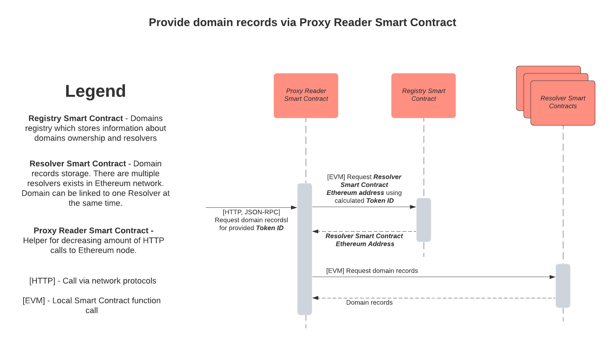

# Basic guide to resolving records

Resolving a domain is a process of retrieving a domain records when the domain name and required record names are given. There is no limitation on who can read domain records on Registry side. Anyone having an access to Ethereum Node on the mainnet can resolve a domain.

Resolving a domain requires a software to have an access to ethereum network. See [Configuring Ethereum Network connection](basic-guide-to-resolving-records.md#configuring-ethereum-network-connection) for more information.

In order to resolve a domain, one would require to make 2 `eth_call` ethereum JSON RPC method calls:

1. Get resolver address via `Registry#resolverOf(tokenId)` where `tokenId` is a ERC721 token of a given domain
2. Get record values via `Resolver#getMany(keys, tokenId)` where `keys` are record names.

Pseudocode example in JavaScript:

```text
const RegistryAddress = "0xD1E5b0FF1287aA9f9A268759062E4Ab08b9Dacbe";
const domain = "example.crypto";
const tokenId = namehash(domain)
const keys = ["crypto.ETH.address", "crypto.BTC.address"];
const resolverAddress = ethCall(RegistryAddress, "resolverOf", tokenId);
const values = ethcall(resolverAddress, "getMany", keys, tokenId);
keys.forEach((k, i) => console.log(k, values[i]))
```



Reference:

* `namehash` - namehashing algorithm implementation. See [Namehashing](../namehashing.md).
* `echCall` - Ethereum JSON RPC implementation for `eth_call` method. See [Ethereum JSON RPC](https://eth.wiki/json-rpc/API#eth_call)

See [Records Reference](reference.md) for more information on which specific records to query.

### Record Value Validation

Crypto resolver doesn't have any built-in record value validation when it is updated for two reasons:

* Any validation would require additional gas to be paid
* Solidity is special purpose programming language that doesn't have any built-in data validation tools like Regular Expressions

Any domain management application must perform record format validation before submitting a transaction. However, there is no guarantee that all management application will do it correctly. That is why records must be validated when domain is resolved too.

See [Records Reference](reference.md) for more information for the validator of each record.

### Configuring Ethereum Network connection

Domain Resolution Configuration at low level requires 3 configuration parameters:

1. Ethereum JSON RPC provider
2. Ethereum CHAIN ID
3. Crypto Registry Contract Address

Ethereum JSON RPC provider is an API implementing Ethereum JSON RPC standard. Usually, it is given in a form of HTTP API end point. However, other forms may exist in case when ethereum node is launched locally. Unstoppable domains recommends [Cloudflare Ethereum Gateway](https://developers.cloudflare.com/distributed-web/ethereum-gateway) an ethereum node service provider.

Ethereum CHAIN ID is an ID of ethereum network a node is connected to. Each RPC provider can only be connected to one network. There is only one production network with CHAIN ID equal to `1` and called `mainnet`. Other networks are only used for testing purposes of different kinds. See [EIP-155](https://eips.ethereum.org/EIPS/eip-155) for more information. CHAIN ID of an ethereum node can be determined by calling [net version method](https://eth.wiki/json-rpc/API#net_version) on JSON RPC which should be used as a default when only JSON RPC provider is given.

Crypto Registry Contract Address is an actual address of a contract deployed. There is only one production registry address on the mainnet: [0xD1E5b0FF1287aA9f9A268759062E4Ab08b9Dacbe](https://etherscan.io/address/0xD1E5b0FF1287aA9f9A268759062E4Ab08b9Dacbe). This address should be used as a default for production configuration.

### 

