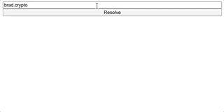
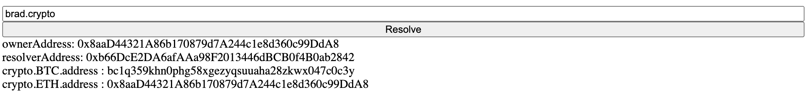
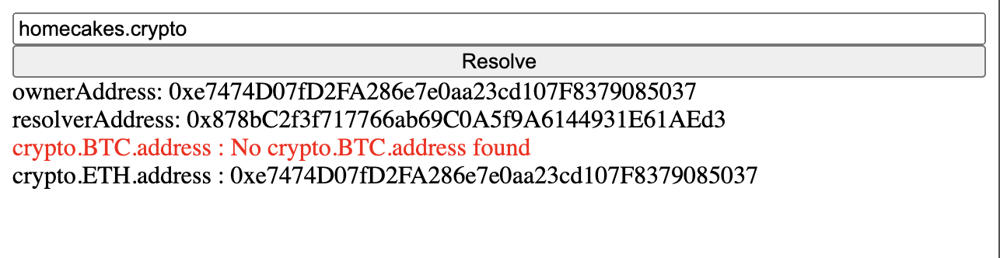

# How to resolve .crypto domain from scratch

In this tutorial we are going to take a look on Unstoppable domains, specifically how one can resolve a .crypto domain using nothing but html, js, and ethers.js library.


## Table of contents

* [Initialize the project folder](resolve-crypto-domain.md#initialize-the-project-folder)
* [Get a namehash of a domain](resolve-crypto-domain.md#taking-a-namehash)
* [Making the call to the contract](resolve-crypto-domain.md#making-the-call-to-the-contract)
* [Displaying results](resolve-crypto-domain.md#displaying-the-records)
* [Error handling](resolve-crypto-domain.md#error-handling)


In order to resolve a .crypto domain, we will need to

* Tokenize the domain
* Configure ethers.js library to call Unstoppable contract
* Make a call and fetch the data

Let's visualize the resolution process using some of the simplest tools web developer has: knowledge of HTML and js.

### Initialize the project folder

As has been said above all we need is to create a folder and three files index.html, index.js, and ethers.js respectively

```text
mkdir unstoppable-crypto-resolution
cd unstoppable-crypto-resolution
touch index.html index.js ethers.js
```

Your project folder should look exactly like the following:
```
.
├── index.html
├── index.js
├── ethers.js
```

#### Index.html
Let's open and configure our html page for the resolution.

From UI perspective we are going to need an input bar, a button to trigger the resolution and a div where we are going to display our records.

From dependencies perspective we are going to connect [js-sha3](https://www.npmjs.com/package/js-sha3?utm_source=cdnjs&utm_medium=cdnjs_link&utm_campaign=cdnjs_library), so we can use **keccak\_256** hash function, and
[ethers.js](https://docs.ethers.io/v5/getting-started/) for a simple way of communication with blockchain contract.

To simplify prototyping we aren't going to use any fancy bundler and connect simple cdn.


We will need the keccak\_256 hash function to tokenize the .crypto domain.


```html
<!DOCTYPE html>
<html lang="en">
    <head>
        <meta charset="utf-8">
        <title>Basic .crypto integration</title>
    </head>
    <body>
      <div id="main" style="
      display: flex;
      flex-direction: column;
      height: 100vh;"
      >

        <input id="input" />
        <button onclick="resolve()">Resolve</button>
        <div id="records" style="display: flex; flex-direction: column;">
  
        </div>
      </div>

      <!-- This exposes keccak_256 hash function -->
      <script
        src="https://cdnjs.cloudflare.com/ajax/libs/js-sha3/0.8.0/sha3.min.js"
        integrity="sha512-PmGDkK2UHGzTUfkFGcJ8YSrD/swUXekcca+1wWlrwALIZho9JX+3ddaaI9wmmf8PmgDIpMtx6TU8YBJAZS0mPQ=="
        crossorigin="anonymous">
      </script>

      <!-- This exposes the library as a global variable: ethers -->
      <script src="https://cdn.ethers.io/lib/ethers-5.0.umd.min.js"
        type="application/javascript"></script>

      <!-- This are our custom files -->
      <script src="ethers.js"></script>
      <script src="index.js"></script>
    </body>
</html>
```

#### Adding some javascript

We are going to start by putting some basic code to capture the text from the input field and print it in our console. We can open `index.html` in a browser to make sure everything is connected and launches 


##### index.js
```javascript
async function resolve() {
  const userInput = document.getElementById("input").value;
  console.log({ domain: userInput });
}
```
## Taking a namehash

Namehashing is an algorithm that tokenizes your domain name in a way that a UD smart contract can understand.

To tokenize our domain we need to split it by the "." character into separate labels, reverse the array, and reduce it to a single hash.

We will implement a recursive `hash function` that does all of the above, `arrayToHex function` to get the result as string and a `wrapper function namehash`

This process is described in more details over our [namehash article](../domain-registry-essentials/namehashing) 

##### index.js
```javascript
function namehash(name) {
  const hashArray = hash(name);
  return arrayToHex(hashArray);
}

function hash(name) {
  if (!name) {
      return new Uint8Array(32);
  }
  const [label, ...remainder] = name.split('.');
  const labelHash = keccak_256.array(label);
  const remainderHash = hash(remainder.join('.'));
  return keccak_256.array(new Uint8Array([...remainderHash, ...labelHash]));
}

function arrayToHex(arr) {
  return '0x' + Array.prototype.map.call(arr, x => ('00' + x.toString(16)).slice(-2)).join('');
}
```
Below you can find a table of some examples for namehashing

| label | namehash |
| :--- | :--- |
| "" | 0x88d4843af302c2093286898cd34cba7a471c3cdce4c78514fc971c3c6a53891e |
| crypto | 0x0f4a10a4f46c288cea365fcf45cccf0e9d901b945b9829ccdb54c10dc3cb7a6f |
| brad.crypto | 0x756e4e998dbffd803c21d23b06cd855cdc7a4b57706c95964a37e24b47c10fc9 |

## Configuring Ethers library

In order to talk with any blockchain contract using ethers.js we need to know the following 

* Contract address
* Contract interface a.k.a. abi
* Provider

Let's add the following information to our **ethers.js** file
##### ethers.js
```javascript
var address = '0xa6E7cEf2EDDEA66352Fd68E5915b60BDbb7309f5';
var abi = [
  {
    constant: true,
    inputs: [
      {
        internalType: 'string[]',
        name: 'keys',
        type: 'string[]',
      },
      {
        internalType: 'uint256',
        name: 'tokenId',
        type: 'uint256',
      },
    ],
    name: 'getData',
    outputs: [
      {
        internalType: 'address',
        name: 'resolver',
        type: 'address',
      },
      {
        internalType: 'address',
        name: 'owner',
        type: 'address',
      },
      {
        internalType: 'string[]',
        name: 'values',
        type: 'string[]',
      },
    ],
    payable: false,
    stateMutability: 'view',
    type: 'function',
  }
];
var provider = ethers.providers.getDefaultProvider('mainnet');
```


For the scope of this project, we are going to need only _getData_ function from our [proxy reader contract](https://etherscan.io/address/0xa6E7cEf2EDDEA66352Fd68E5915b60BDbb7309f5#code).


Next, we need to create a contract instance and create a function to query our contract

##### ethers.js
```javascript
var contract = new ethers.Contract(address, abi, provider);

async function fetchContractData(keys, tokenId) {
  return contract.getData(keys, tokenId);
}
```

By inspecting the getData function interface we can see that it requires from us an **array of keys** and **tokenId**. We can get **tokenId** by calling **namehash** function from above. 

Although any string can be stored as a key under the domain, Unstoppable domains has [standardized some of the keys](../domain-registry-essentials/records-reference.md) across many applications.

In this tutorial, we are going to be looking up for the following records:

| Key | Description |
| :--- | :--- |
| crypto.BTC.address | BTC address attached to the domain |
| crypto.ETH.address | ETH address attached to the domain |

## Making the call to the contract

Let's update our resolve function to use namehash, and look up the desired record keys from the input domain name. We are going to print them in the console to inspect in more details before visualizing them

##### index.js
```javascript
async function resolve() {
  const userInput = document.getElementById("input").value;
  const tokenId = namehash(userInput);
  
  const interestedKeys = [
    "crypto.BTC.address",
    "crypto.ETH.address",
  ];
  
  fetchContractData(interestedKeys, tokenId).then(data => {
    console.log({
      ownerAddress: data.owner,
      resolverAddress: data.resolver,
      records: data[2]
    });
  });
}
```

Trying to resolve brad.crypto with the above keys returns us the following in the console

```javascript
{
  "ownerAddress":"0x8aaD44321A86b170879d7A244c1e8d360c99DdA8",
  "resolverAddress":"0xb66DcE2DA6afAAa98F2013446dBCB0f4B0ab2842",
  "records":[
    "bc1q359khn0phg58xgezyqsuuaha28zkwx047c0c3y",
    "0x8aaD44321A86b170879d7A244c1e8d360c99DdA8"
    ]
}
```


data[2] is an array containing all resolved records in the same order as has been queried. In this case, the first argument is BTC address and the last one is an ETH address attached to the domain.


## Displaying the records

Since this is a simple example we won't get too fancy. We'll just create a span element for each record containing its key and value, its owner address, and its resolver address. And if the record is not found we are going to say so in red color.

##### index.js
```javascript
function cleanDOM(parent) {
  while (parent.firstChild) {
    parent.removeChild(parent.firstChild);
  }
}

function displayResolution(resolution) {
  const {ownerAddress, resolverAddress, records} = resolution;
  const mainContainer = document.getElementById('records');

  cleanDOM(mainContainer);

  const ownerRecord = document.createElement('span');
  ownerRecord.innerHTML = `ownerAddress: ${ownerAddress}`;
  const resolverRecord = document.createElement('span');
  resolverRecord.innerHTML = `resolverAddress: ${resolverAddress}`;

  mainContainer.appendChild(ownerRecord);
  mainContainer.appendChild(resolverRecord);

  Object.entries(records).map(([key, value]) => {
    const recordSpan = document.createElement('span');
    if (!value) {
      recordSpan.style.color = 'red';
      value = `No ${key} found`;
    }
    recordSpan.innerHTML = `${key} : ${value}`;
    mainContainer.appendChild(recordSpan);
  });
}
```

Before we can use this function we will need to combine the records values with the keys.

##### index.js
```javascript
function combineKeysWithRecords(keys, records) {
  const combined = {};
  keys.map((key, index) => {
    combined[key] = records[index];
  });
  return combined;
}
```

Now we can easily show the records on our page:

##### index.js
```javascript
fetchContractData(interestedKeys, tokenId).then(data => {
    displayResolution({
      ownerAddress: data.owner,
      resolverAddress: data.resolver,
      records: combineKeysWithRecords(interestedKeys, data[2])
    });
  });
```
We should see the following on successful resolution.


## Error handling

Now that we have made a successful call let's deal with all possible errors that could happen during the resolution. For this purpose, we can create a function to place an error in our records div. We also added a boolean argument `cleanDom` to remove everything from the records div before we put an error if needed.

##### index.js
```javascript

function displayError(message, cleanDom) {
  const mainContainer = document.getElementById('records');
  if (cleanDom) {
    cleanDOM(mainContainer);
  }
  const error = document.createElement('p');
  error.style.color = "red";
  error.innerHTML = message;
  mainContainer.appendChild(error);
  return ;
}
```

Error troubleshooting
| Error | Thrown when |
| :--- | :--- |
| **Domain is not registered** | Owner address is equal to  `0x00000000000000000000000000000000`|
| **Domain is not supported** | We are trying to resolve a domain that doesn't ends with .crypto |
| **Domain is not configured** | It is possible that owner address exists while the resolver address is set to `0x00000000000000000000000000000000` |
| **Record is not found** | This is returned when you query a domain for a records like `crypto.BTC.address` which the domain owner has not set |

In our case we will update the callback to the `fetchContractData` function to include these possible errors.

```javascript

function isEmpty(msg) {
  return !msg || msg === '0x0000000000000000000000000000000000000000';
}

async function resolve() {
  const userInput = document.getElementById("input").value;

  if (!userInput.endsWith(".crypto")) {
    displayError('domain is not support', true);
    return ;
  }
  const tokenId = namehash(userInput);
  
  const interestedKeys = [
    "crypto.BTC.address",
    "crypto.ETH.address",
  ];
  
  fetchContractData(interestedKeys, tokenId).then(data => {
    if (isEmpty(data.owner)) {
      displayError('Domain is not registered', true);
      return ;
    }

    if (isEmpty(data.resolver)) {
      displayError('Domain is not configured', true);
      return ;
    }

    displayResolution({
      ownerAddress: data.owner,
      resolverAddress: data.resolver,
      records: combineKeysWithRecords(interestedKeys, data[2])
    });
  });
}
```




At this point you can now resolve any .crypto domain and show an appropriate error message for your users. Just open `index.html` file in your browser and play a little with a results to get a taste of it. 

Some domains to test:
| Domain | result |
| :--- | :--- |
| brd.crypto | resolve without any errors |
| brad.anything | domain is not supported |
| homecakes.crypto | domain has no BTC record |
| unregistered.crypto | domain is not registered |
| reseller-test-paul2.crypto | domain is not configured |

The full source code for this guide can be found on [github](https://github.com/unstoppable-domains-integrations/crypto-integration).


[](https://discord.gg/b6ZVxSZ9Hn)

If you have questions, visit our Unstoppable Domains Developer Community on Discord.