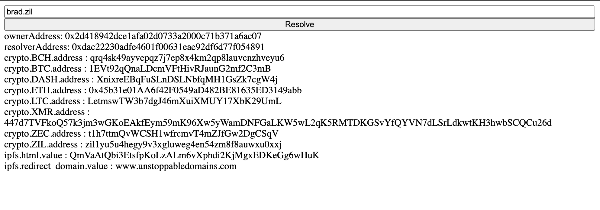
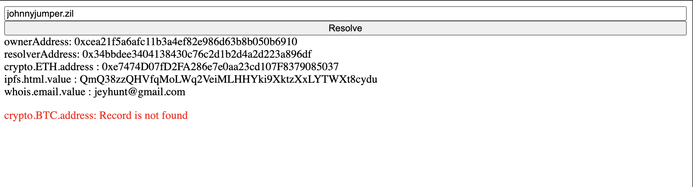

# Resolve a .zil domain

## Where can I get .zil domain?
The most simpliest way is to go to [Unstoppable Domains website](https://www.unstoppabledomains.com) and buy one for yourself
## Table of contents


* [Initialize the project folder](resolve-zil-domain.md#initialize-the-project-folder)
* [Get a namehash of a domain](resolve-zil-domain.md#taking-a-namehash)
* [Get resolver contract address from a domain](resolve-zil-domain.md#getting-resolver-address)
* [Query resolver contract to fetch the records](resolve-zil-domain.md#fetching-the-domain-records)
* [Displaying results](resolve-zil-domain.md#displaying-result)
* [Error handling](resolve-zil-domain.md#error-handling)

## Initialize the project folder
#### Dependencies
We are going to build the project using [parcel.js](https://parceljs.org/), a very intuitive and simple bundler for fast development

For this project we will need [hash.js](https://www.npmjs.com/package/hash.js/v/1.1.7) for taking sha256 of a domain name


```shell
npm install -g add parcel-bundler

mkdir unstoppable-zil-resolution
cd unstoppable-zil-resolution

npm init
npm install hash.js

touch index.ts index.html


Your resulting folder structure should look like this
.
├── index.html
├── index.ts
├── node_modules
├── package.json

```

#### Pakage.json

Now open **package.json** and configure some scripts.

As has been said above, this project is built by utilizing parcel.js. One of the features of which is a development server already prepared for us. We can use it by calling ```parcel <entry file>```

We also need to add a browserslist due to [babel technology](https://flaviocopes.com/parcel-regeneratorruntime-not-defined/) that is used by parcel. 

Resulted **package.json** should look like this

```javascript
  {
  "name": "unstoppable-resolution",
  "version": "0.1.0",
  "private": true,
  "dependencies": {
    "hash.js": "^1.1.7"
  },
  "scripts": {
    "dev": "parcel index.html",
    "build": "parcel build index.html"
  },
  "browserslist": [
    "since 2017-06"
  ]
}
```

As our next step, let's open our HTML page and add some boilerplate code.

#### index.html

```markup
<!DOCTYPE html>
<html lang="en">
    <head>
        <meta charset="utf-8">
        <title>Basic .zil integration</title>
    </head>
    <body>
      <div id="main" style="
        display: flex;
        flex-direction: column;
        height: 100vh;
      ">
        <input id="input" />
        <button id="button">Resolve</button>
        
        <div id="records" style="display: flex; flex-direction: column;">

        </div>
      </div>
      <script src="./index.ts"></script>
  </body>
</html>
```

<sup>Shortly it is simple html document with a single div element in the body. It contains input field for our user, button to trigger the resolution, and another div for displaying the results</sup>

### Add some javascript

Create file _index.js_, import our hash library for future encoding, and define some constants. 

| constant | description |
| :--- | :--- |
| **ZILLIQA_API** | an official zilliqa endpoint which serves us an entry point to zilliqa blockchain |
| **UD_REGISTRY_CONTRACT_ADDRESS** | Registry address of UD without _0x_ prefix |


What is registry contract is going to be discussed later in this guide.

#### index.js
```javascript
import hash from 'hash.js';

const ZILLIQA_API = "https://api.zilliqa.com/";
const UD_REGISTRY_CONTRACT_ADDRESS = "9611c53BE6d1b32058b2747bdeCECed7e1216793";

```

Next, we need to define and attach a function **resolve** to our HTML button under `id="button"`.

We start writing this function by simply taking our input from the text field and preparing to handle incorrect domain. We will comeback for [error handling](resolve-zil-domain.md#error-handling) later  


Any domain that doesn't ends with **.zil** is out of scope of this article.
{% endhint }

#### index.js
```javascript
import hash from 'hash.js';

const ZILLIQA_API = "https://api.zilliqa.com/";
const UD_REGISTRY_CONTRACT_ADDRESS = "9611c53BE6d1b32058b2747bdeCECed7e1216793";

async function resolve() {
  const userInput = (document.getElementById("input")).value;
  if (!userInput.endsWith(".zil") {
    // placeholder for future error handling
    return ;
  }
}

document.getElementById("button").addEventListener('click', () => resolve());
```

## Taking a namehash

Namehashing is an algorithm that tokenize your domain name in a way that Zilliqa smart contract can understand.


It is essential to know the difference between Zilliqa namehashing and [EIP-137](https://github.com/ethereum/EIPs/blob/master/EIPS/eip-137.md#namehash-algorithm). In ZIL we use **sha256 from SHA-2**, instead of **keccak256** which is used across the Ethereum


To tokenize our domain we need to split it by the "." character into separate labels, reverse the array, and reduce it to a single hash using a childhash function. Childhash function generates a hash of the current label, concatenates it with the parent, and hashes the result as a hex value. As our first parent, we take a string of **64 zeros**

#### index.js
```javascript
function namehash(domain) {
  const parent =
    '0000000000000000000000000000000000000000000000000000000000000000';
  return '0x' + [parent]
    .concat(
      domain
        .split('.')
        .reverse()
    )
    .reduce((parent, label) =>
      childhash(parent, label),
    );
}

function childhash(parentHash, label) {
    parentHash = parentHash.replace(/^0x/, '');
    const labelHash = sha256(label)
    return sha256(parentHash + labelHash, "hex");
}

function sha256(message, inputEnc) {
  return hash.sha256()
    .update(message, inputEnc)
    .digest('hex');
}
```

Below you can find a table of some examples for namehashing

| domain | namehash |
| :--- | :--- |
| "" | 0x1c9ecec90e28d2461650418635878a5c91e49f47586ecf75f2b0cbb94e897112 |
| zil | 0x9915d0456b878862e822e2361da37232f626a2e47505c8795134a95d36138ed3 |
| brad.zil | 0x5fc604da00f502da70bfbc618088c0ce468ec9d18d05540935ae4118e8f50787 |

## Getting resolver address

Our next step is to fetch two very important addresses attached to every unstoppable domain: **owner address** and **resolver contract address**. We can get them by querying [Unstoppable domain registry contract](https://viewblock.io/zilliqa/address/zil1jcgu2wlx6xejqk9jw3aaankw6lsjzeunx2j0jz)

While the owner's address is pretty self-explanatory, the resolver contract address requires some explanation. All unstoppable domains are located across 2 main smart contracts: **Registry** and **Resolver**

| contract | explanation |
| :--- | :--- |
| Registry contract | Stores owner address and resolver contract address if deployed |
| Resolver contract | Stores all records attached to the domain, such as BTC address or an IPFS website |

So in order to get the BTC address from the domain we will need to query for domain's resolver contract first and after query resolver contract for records.

Let's write a function to make a JSON-RPC POST API request to Zilliqa blockchain using their gateway. The function is going to take an array of parameters that we want to send and make an post call to the zilliqa api.

#### index.js
```javascript
async function fetchZilliqa(params) {
  const body = {
    method: "GetSmartContractSubState",
    id: "1",
    jsonrpc: "2.0",
    params
  };

  return await fetch(ZILLIQA_API, {
    method: "POST",
    headers: {
      "Content-Type": "application/json"
    },
    body: JSON.stringify(body),
  }).then(res => res.json());
}
```

Parameters that we are going to be send are 

* **contract address** we want to query,
* **contract field name** we will use string `records`,
* **contract state keys** array of strings, in our case namehash of the domain is the only value in the array, 

Let's update our resolve function and use the **fetchZilliqa** function

#### index.js
```javascript
async function resolve() {
  const userInput = document.getElementById("input").value;
  if (!userInput.endsWith(".zil") {
    // placeholder for future error handeling
    return ;
  }

  const hash = namehash(userInput);
  const registryState = 
    await fetchZilliqa([UD_REGISTRY_CONTRACT_ADDRESS, "records", [hash]]);
    
  if (contractAddress.result === null) {
    // placeholder for future error handeling
    return ;
  }
  const [ownerAddress, resolverAddress] = 
    registryState.result.records[hash].arguments;
  console.log({ownerAddress, resolverAddress});
  
}
```

Calling fetchZilliqa with namehash of _**brad.zil**_ returns us the following:

```javascript
{
  id: "1",
  jsonrpc: "2.0",
  result: {
    records: {
        0x5fc604da00f502da70bfbc618088c0ce468ec9d18d05540935ae4118e8f50787: {
            argtypes: [],
            arguments: [
                "0x2d418942dce1afa02d0733a2000c71b371a6ac07",
                "0xdac22230adfe4601f00631eae92df6d77f054891"
            ],
            constructor: "Record"
        }
    }
  }
}
```


Order is very important, as the first address in the arguments array is the owner address and the second one is a resolver contract address



Make sure to display your user an appropriate error if an owner address is not set. This means that the domain is not registered under any user and is free to be taken. 


## Fetching the domain records

After we verified that domain has owner address and got it's resolver contract address we are going to query the second one again for it's records.

Make use of fetchZilliqa again, only this time change params to contain the **resolver address** and for the state keys we will pass an empty array

```typescript
// index.ts resolve function
const records = await fetchZilliqa([
    resolverAddress.replace("0x", ""),
    "records",
    []
  ]);
  console.log(records.result.records);
```


**It is very important to remove the leading 0x from the contract address
Otherwise the contract won't be found and you will get an error**


We should get an object printed on our console with all the keys registered under the domain. Let's test it out with domain _**brad.zil**_**.** As the result, you should get something similar to the following 

```javascript
{
"crypto.BCH.address": "qrq4sk49ayvepqz7j7ep8x4km2qp8lauvcnzhveyu6",
"crypto.BTC.address": "1EVt92qQnaLDcmVFtHivRJaunG2mf2C3mB",
"crypto.DASH.address": "XnixreEBqFuSLnDSLNbfqMH1GsZk7cgW4j",
"crypto.ETH.address": "0x45b31e01AA6f42F0549aD482BE81635ED3149abb",
"crypto.LTC.address": "LetmswTW3b7dgJ46mXuiXMUY17XbK29UmL",
"crypto.XMR.address": "447d7TVFkoQ57k3jm3wGKoEAkfEym59mK96Xw5yWamDNFGaLKW5wL2qK5RMTDKGSvYfQYVN7dLSrLdkwtKH3hwbSCQCu26d",
"crypto.ZEC.address": "t1h7ttmQvWCSH1wfrcmvT4mZJfGw2DgCSqV",
"crypto.ZIL.address": "zil1yu5u4hegy9v3xgluweg4en54zm8f8auwxu0xxj",
"ipfs.html.value": "QmVaAtQbi3EtsfpKoLzALm6vXphdi2KjMgxEDKeGg6wHuK",
"ipfs.redirect_domain.value": "www.unstoppabledomains.com",
}
```

## Displaying result

We are not going to do anything fancy, only create a span element for each of the records containing key and value as well as owner address and resolver address. 

```typescript
// index.ts
function cleanDOM(parent) {
  while (parent.firstChild) {
    parent.removeChild(parent.firstChild);
  }
}

type Resolution = {
  resolverAddress: string,
  ownerAddress: string,
  records: {
    [key in string]: string}
  };

function displayResolution(resolution: Resolution) {
  const {ownerAddress, resolverAddress, records} = resolution;
  const mainContainer = document.getElementById('records');

  cleanDOM(mainContainer);
  const ownerRecord = document.createElement('span');
  ownerRecord.innerHTML = `ownerAddress: ${ownerAddress}`;
  const resolverRecord = document.createElement('span');
  resolverRecord.innerHTML = `resolverAddress: ${resolverAddress}`;

  mainContainer.appendChild(ownerRecord);
  mainContainer.appendChild(resolverRecord);

  Object.entries(records).map(([key, value]) => {
    const recordSpan = document.createElement('span');
    recordSpan.innerHTML = `${key} : ${value}`;
    mainContainer.appendChild(recordSpan);
  });
}
```

We should see something like following on successful resolution



### Error handling

Now that we have made a successful call let's deal with all possible errors that could happen during the resolution. For this purposes, we are going to create a function that will place an error in our records div

```typescript
// index.ts
function displayError(message: string, cleanDom?: boolean) {
  const mainContainer = document.getElementById('records');
  if (cleanDom) {
    cleanDOM(mainContainer);
  }
  const error = document.createElement('p');
  error.style.color = "red";
  error.innerHTML = message;
  mainContainer.appendChild(error);
  return ;
}
```

Errors that can happen are 

* **Domain is not registered** -&gt; Happens when we couldn't get the owner address
* **Domain is not supported** -&gt; When we trying to resolve a domain that doesn't end with .zil
* **Domain is not configured** -&gt; It is possible the owner has claimed the domain but the resolver contract wasn't configured \(meaning it has the owner address and doesn't have the resolver address attached\) 
* **Record is not found** -&gt; This can be useful if you are querying domain for specific records and it is null

Although any string can be stored as a key under the domain, Unstoppable domains [standardized some of the keys](https://docs.unstoppabledomains.com/domain-registry-essentials/records-reference) across many applications.   

For the record is not found error message we are going to check if the domain has a BTC address and if not we will show the error without cleaning the entire DOM  

```typescript
type Resolution = {
  resolverAddress: string,
  ownerAddress: string,
  records: {
    [key in string]: string}
  };

function displayResolution(resolution: Resolution) {
  const {ownerAddress, resolverAddress, records} = resolution;
  const mainContainer = document.getElementById('records');
  
  cleanDOM(mainContainer);
  const ownerRecord = document.createElement('span');
  ownerRecord.innerHTML = `ownerAddress: ${ownerAddress}`;
  const resolverRecord = document.createElement('span');
  resolverRecord.innerHTML = `resolverAddress: ${resolverAddress}`;

  mainContainer.appendChild(ownerRecord);
  mainContainer.appendChild(resolverRecord);

  Object.entries(records).map(([key, value]) => {
    const recordSpan = document.createElement('span');
    recordSpan.innerHTML = `${key} : ${value}`;
    mainContainer.appendChild(recordSpan);
  });

  if (!records['crypto.BTC.address']) {
    displayError('crypto.BTC.address: Record is not found', false);
  }
}

async function resolve() {
  const userInput = (<HTMLInputElement>document.getElementById("input")).value;
  if (!userInput.endsWith(".zil")) {
    displayError('domain is not supported');
    return ;
  }

  const hash = namehash(userInput);  
  const contractAddresses = await fetchZilliqa([UD_REGISTRY_CONTRACT, "records", [hash]]);
  
  if (contractAddresses.result == null) {
    displayError('domain is not registered', true);
    return ;
  }
  const [ownerAddress, resolverAddress] = await contractAddresses.result.records[hash].arguments;

  if (resolverAddress === "0x0000000000000000000000000000000000000000") {
    displayError('domain is not configured', true);
    return ;
  }

  const records = await fetchZilliqa([
    resolverAddress.replace("0x", ""),
    "records",
    []
  ]).then(data => (data.result.records));
  
  displayResolution({resolverAddress, ownerAddress, records});
}
```


If domain doesn't have a resolver address it will be set as **"0x0000000000000000000000000000000000000000"**

_You  can check it with the domain: **paulalcock.zil**_


By this moment you can successfully resolve any .zil domain and show an appropriate error message for your users.

