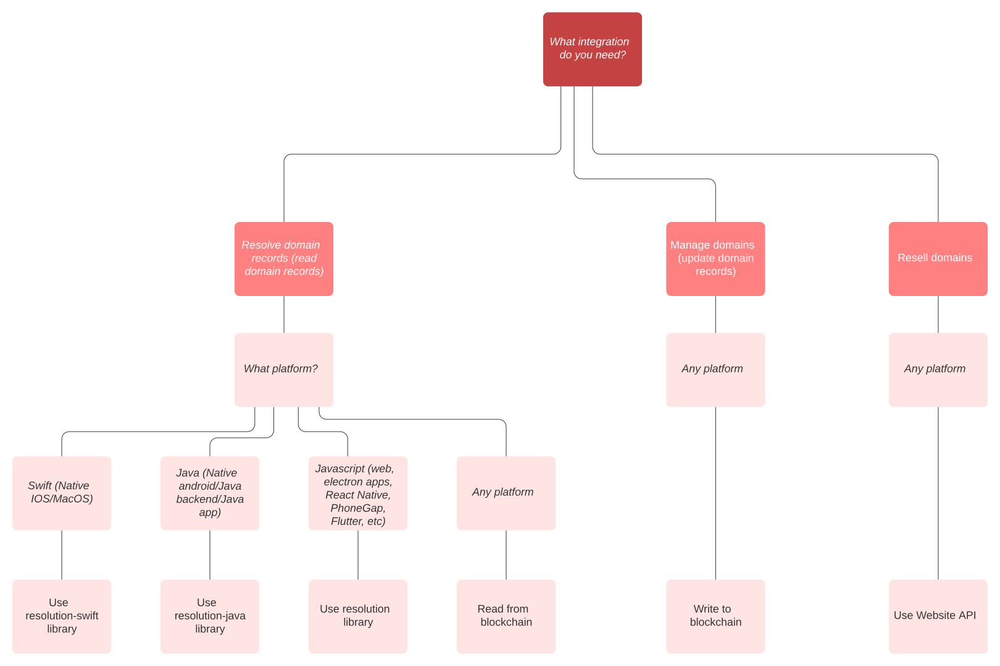

# Intergrations Getting Started

Unstoppable provides multiple ways to integrate. Unstoppable recommends preferred ways for each type of integration.

## References

### Libraries
* [JavaScript Resolution library](https://github.com/unstoppabledomains/resolution)
* [Java Resolution library](https://github.com/unstoppabledomains/resolution-java)
* [Swift Resolution library](https://github.com/unstoppabledomains/resolution-swift)

### Website API documentation
* [Website API reference](https://apidocs.unstoppabledomains.com/)

### Read from blockchain
Direct read from Unstoppable Smart Contracts without using Unstoppable libraries. Prior knowledge of blockchain is required to implement this method.       
* [Smart contracts reference](../domain-registry-essentials/cns-smart-contracts.md)  
* [Records reference](../domain-registry-essentials/records-reference.md)  
* [Resolving domain records](../domain-registry-essentials/resolving-domain-records.md)  

### Write to blockchain
Direct write from Unstoppable Smart Contracts without using Unstoppable libraries. Prior knowledge of blockchain is required to implement this method.   
* [Smart contracts reference](../domain-registry-essentials/cns-smart-contracts.md) 
* [Managing domain records](../managing-domains/managing-domain-records.md)  
* [Managing domain ownership](../managing-domains/managing-domain-ownership.md)

MyEtherWallet implemented domain management and can be used as a reference for implementation.  
* [MyEtherWallet code reference](https://github.com/MyEtherWallet/MyEtherWallet/tree/master/src/dapps/Unstoppable)    
* [MyEtherWallet website](https://www.myetherwallet.com)

