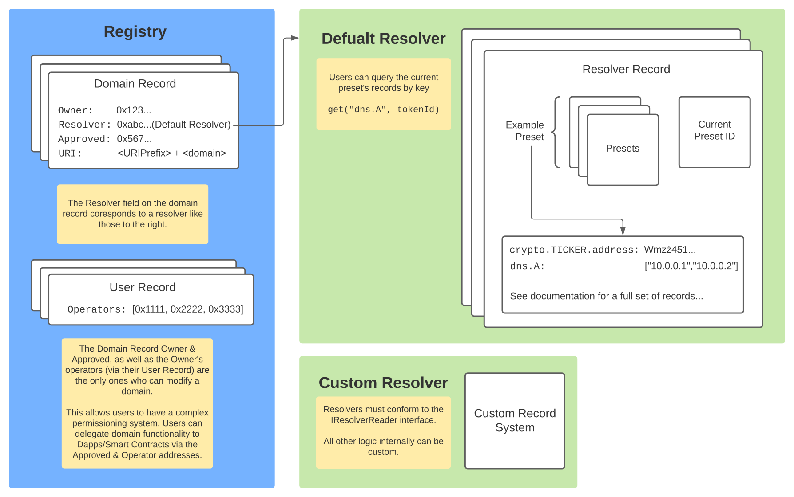

# Managing Domain Records

Domain records can be managed via the default public resolver, or one can develop a custom resolver with any management permissions defined.



## Resolver Record Types

Records on the top-level are stored in a simple key-value pair mapping string to string. CNS doesn't forbid a user to assign any record to any value. However, there is a list of standard records that have a defined standard interpretation by clients. A full list of standardized records can be found in the [Records Reference](../domain-registry-essentials/records-reference.md).

Standard record keys are split by namespaces with a `.` used as a separator.

Main namespaces are:

* `crypto.*` - records related to crypto payments
* `dns.*` - DNS records
* `dweb.*` - records related to distributed content network protocols
* `browser.*` - hint records for web browsers

### Crypto Payments Records

One essential feature of blockchain domains is the ability to specify a domain instead of a destination address for your crypto payment. Cryptocurrency wallets that need this feature should resolve a domain to crypto address under the hook in the same way a browser resolves a domain to IP address.

All crypto addresses are stored within `crypto.*` namespace. Each currency address is stored as `crypto.<TICKER>.address` record. Example: Bitcoin address is stored in `crypto.BTC.address`. Addresses are stored in plain text format according to an address space standard established by each currency. The currency's namespace can contain additional currency-specific attributes to facilitate payment delivery. Example: [Ripple Destination Tag](https://xrpl.org/source-and-destination-tags.html). However, key names for those attributes are not yet standardized. Please contact [Unstoppable Domains Support](mailto:support@unstoppabledomains.com) if you need such attributes to be added to the standard.

Some tickers of very popular cryptocurrencies are not yet standardized. Example: `LINK` for [Chainlink](https://coinmarketcap.com/currencies/chainlink). A standardized list of tickers can be found in [SLIP-0044](https://github.com/satoshilabs/slips/blob/master/slip-0044.md). However, a more extended list of conventional tickers is available at [cripti/cryptocurrencies](https://github.com/crypti/cryptocurrencies/blob/master/cryptocurrencies.json).

Example crypto records setup:

| Key | Value |
| :--- | :--- |
| `crypto.ETH.address` | `0xD1E5b0FF1287aA9f9A268759062E4Ab08b9Dacbe` |
| `crypto.BTC.address` | `bc1qkd4um2nn2uyzmsch5y86wsa2pfh8xl445lg9nv` |
| `crypto.ZIL.address` | `zil1yu5u4hegy9v3xgluweg4en54zm8f8auwxu0xxc` |

## Resolver Administrative Patterns

### Default Resolvers' Record Ownership Style

The default Unstoppable resolver allows users to manage all domain records for any address given a permission over domain utilizing the [ERC721 "Transfer Mechanism"](https://eips.ethereum.org/EIPS/eip-721). This enables a subset of addresses to manage the domain on your behalf. By default we give the permission to do this to every address that can already transfer ownership of the domain. These include:

* Owner address of a domain
* Approved address for a domain
* Owner's operator addresses

This enables Users to enable smart contract applications and other users to manage one or all of the domains, while still retaining primary ownership of their domain. These smart contracts can be programed in such a way that they only change specified records. An Oracle Integration works in this way. Here is an example Flow:

1. Users grant operator access to all of their domains to the Oracle Contract.
2. Oracle detects an event off chain.
3. The Oracle sets a record inside the resolver contract.

See ERC721 on how those permissions can be granted and revoked. Any records change is submitted as a [Ethereum Blockchain Transaction](https://ethereum.org/en/whitepaper/#messages-and-transactions). And how record management can be done via [Resolver methods](https://github.com/unstoppabledomains/dot-crypto/blob/master/contracts/IResolver.sol).

What is important about this model is you can delegate trust to change records to smart contracts. This enables users to interact with applications that could store keys and other information on a domain. Making the domains a metadata repository or cross application identifier.

### Alternative Ownership Styles

Resolvers can be made with custom logic. For example users with a large amount of domains might want to deploy a custom `Owned` resolver contract. See [EIP-173](https://eips.ethereum.org/EIPS/eip-173). Where there is only one set of records, and only the owner can set them.

```text
pragma solidity ^0.7.0;

import "./Owned.sol";

contract CustomResolver is Owned {
  mapping (string => string) internal _records;

  function set(string memory key, string memory value) public onlyOwner {
    _records[key] = value;
  }

  function get(string memory key, uint256 /* unused tokenId */) public returns (string memory) {
    return _records[key];
  }

  // ...
  // Rest of the IResolver.sol methods
  // ...
}
```

This smart contract will read from the same set of records every time, allowing for efficient updating of multiple domains at once. See more in [Deploying Custom Resolvers](deploying-custom-resolver.md).

### Presets

The resolver also implements a preset mechanism. The records inside the Resolver are stored as a nested mapping.

`Token ID -> Preset ID -> Key -> Value`

This nested structure allows users to configure domains on the un-enumerable Ethereum mappings. Typically it is expensive and unreliable to store an enumerable data structure on Ethereum. To get around this domains store a preset that corresponds to a record set. This means that users can change the preset on the domain to get an entirely different set of records.

Currently `reset` and `reconfigure` are the only methods exposed on this version of resolver.

* The `reset` method clears the domain's records by setting the preset on the domain to the timestamp when the transaction was mined e.g. `blockchain.timestamp`.
* The `reconfigure` method first `reset`'s the domain then configures a new set of records.

### Pre-configuring Records

The Default Resolver allows the Unstoppable Minting EOAs to mint and preconfigure domains in one step. This `preconfigure` method only lets the Minting EOAs configure unowned domains not names already minted to the CNS Registry.

