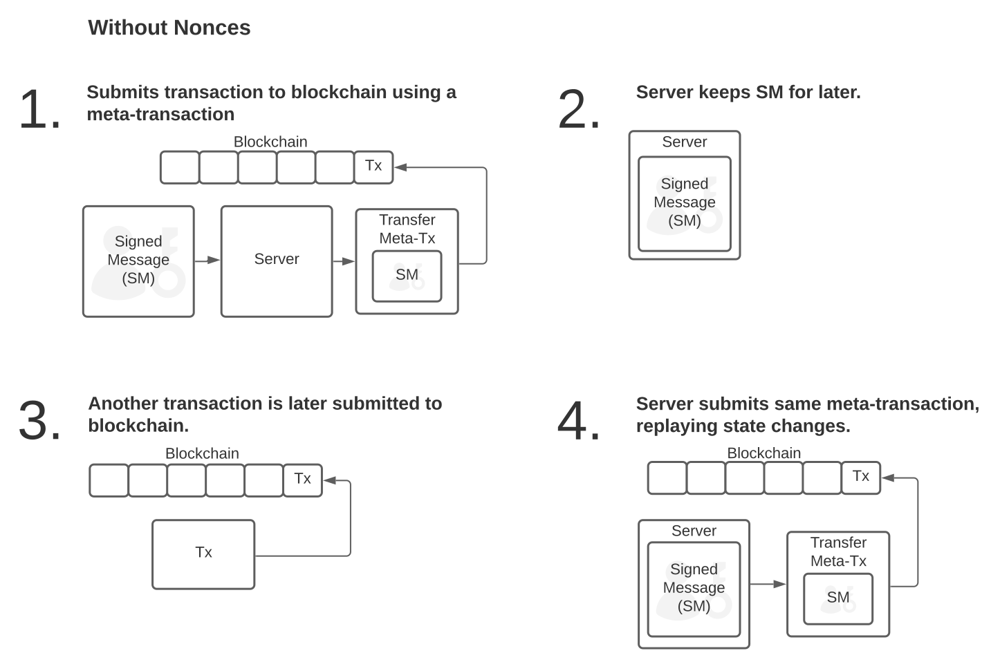

# Meta Transactions

Most Registry and Resolver methods have meta-transaction support. Generally, meta-transactions allow users to sign messages to control their domains that are then submitted to the registry by a different party. This enables Unstoppable to submit transactions on behalf of users, so that the user can still manage their domains in a self-custodial capacity without any gas.

Meta-transactions work by having users sign function calls along with a nonce. Sending that signed function call over to a different party. That party calls the meta-transaction enabled function on the Registry or Resolver. For most management methods, there is a method with meta-transaction support that has `For` suffix at the end. The meta-transaction method then checks the permission for a domain against the address recovered from the signed message sent to the function, unlike base method that checks it against the submitter of the transaction e.g. `msg.sender`.


Concretely `resetFor` is a meta-transaction version of reset. This method has an additional `signature` argument as a last parameter beside all original parameters.

Note that the meta-transaction versions of Registry functions are implemented in controller contract, not in the registry itself. See [Registry Controllers](https://github.com/unstoppabledomains/dot-crypto/blob/master/ARCHITECTURE.md#registry-controllers).

A source code of signature validation can be found in [SignatureUtil.sol](https://github.com/unstoppabledomains/dot-crypto/blob/master/contracts/util/SignatureUtil.sol)

## Token Nonce

Meta transaction methods are bound to names via a their nonce \(instead of [Account Nonce](https://ethereum.stackexchange.com/questions/27432/what-is-nonce-in-ethereum-how-does-it-prevent-double-spending) of traditional transactions\). It protects from [Double-spending](https://en.wikipedia.org/wiki/Double-spending) in the same way as account based nonce in traditional transactions.

The example below shows how replay attacks can be used to exploit domains:



A nonce is simply a transaction counter for each token. This prevents replay attacks where a transfer of a token from A to B can be replayed by B over and over to continually revert the state of the name back to a previous state. This counter must increment up by 1 each time a state transition happens to a token. Token based nonces can be used to prevent mis-ordering of transactions in a more general sense as well. This prevents front running non fungible assets and this property can also be used to batch transactions securely as well.


## **Meta transaction signature generation**

Meta transaction requires 2 signature: one passed as a method argument and one classical. Classical signature is generated in a standard way. Meta signature requires a domain owner \(or a person approved by owner\) to sign a special message formed from:

* Domain based meta-transaction nonce
* [Function Selector](https://solidity.readthedocs.io/en/v0.7.0/abi-spec.html#function-selector) of the original method
* Original Method parameters \(the one without signature\)

Example Signature generation for a `reset` method call for a domain:

```text
const domain = 'example.crypto';
const methodName = 'reset';
const methodParams = ['uint256'];
const contractAddress = '0xb66DcE2DA6afAAa98F2013446dBCB0f4B0ab2842';
// Can be different or the same as contractAddress
const controllerContractAddress = '0xb66DcE2DA6afAAa98F2013446dBCB0f4B0ab2842';
const tokenId = namehash(domain);

function generateMessageToSign(
  contractAddress: string,
  signatureContract: string,
  methodName: string,
  methodParams: string[],
  tokenId: string,
  params: any[],
) {
  return solidityKeccak256(
    ['bytes32', 'address', 'uint256'],
    [
      solidityKeccak256(
        ['bytes'],
        [encodeContractInterface(contractAddress, method, methodParams, params)],
      ),
      controllerContractAddress,
      ethCallRpc(controllerContractAddress, 'nonceOf', tokenId),
    ],
  );
}

const message = generateMessageToSign(
  contractAddress,
  signagureContractAddress,
  methodName,
  methodParams,
  tokenId,
  [tokenId]
);
```

Functions Reference:

* `namehash` - [Namehashing Function](../domain-registry-essentials/namehashing.md) algorithm implementation
* `ethCallRpc` - Ethereum `eth_call` JSON RPC implementation
* `encodeContractInterface` - [Solidity ABI](https://solidity.readthedocs.io/en/v0.7.0/abi-spec.html#argument-encoding) interface parameters encoder
* `solidityKeccak256` - [Solidity ABI](https://solidity.readthedocs.io/en/v0.7.0/abi-spec.html#argument-encoding) parameters encoder

