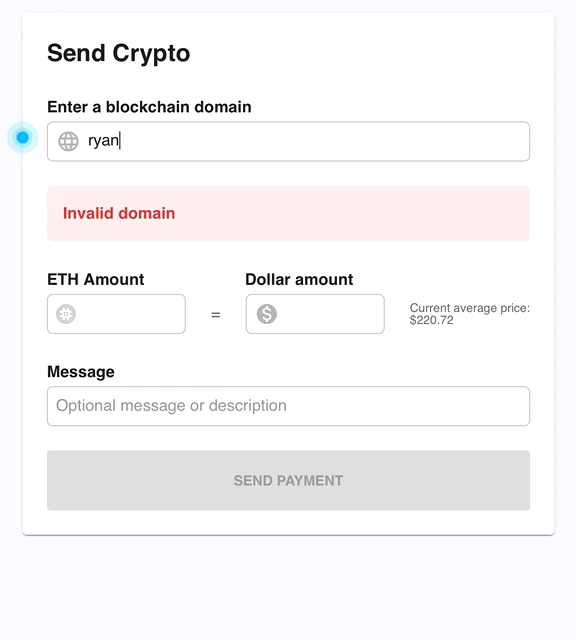
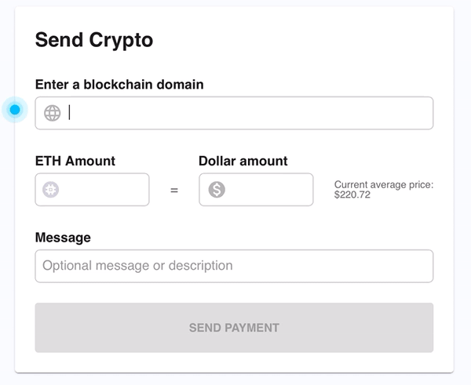
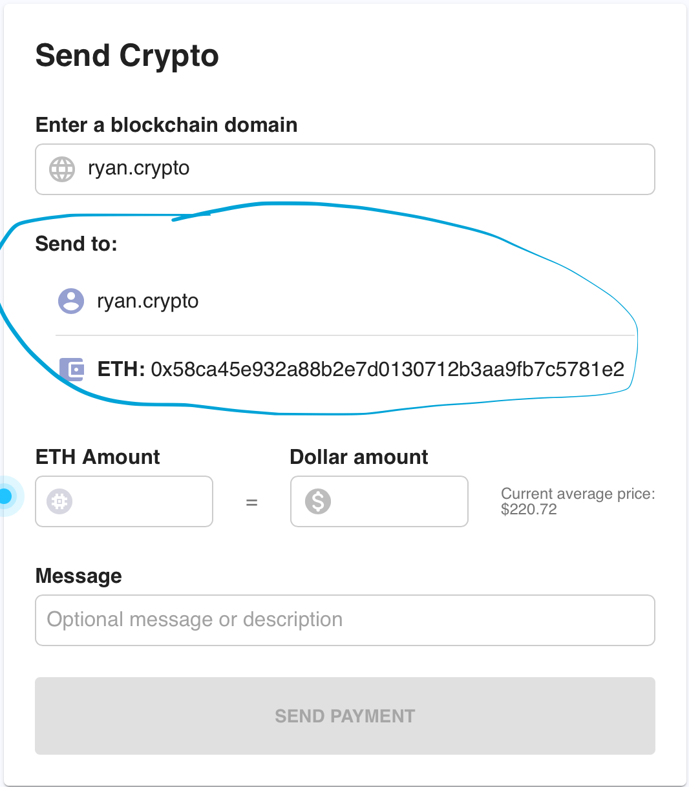

# Crypto Payments

## Table of contents

* [Overview](crypto-payments.md#overview)
* [Enabling domain resolution using libraries](crypto-payments.md#enabling-domain-resolution)
  * [Resolving crypto records](crypto-payments.md#resolving-crypto-records)
  * [Error handling](crypto-payments.md#error-handling)
  * [Best practices](crypto-payments.md#integration-best-practices)
* [Resources](crypto-payments.md#resources)

## Overview

The most common way to integrate with Unstoppable Domains is through simple domain resolution. This process converts a human-readable name like `brad.crypto` to the cryptocurrency addresses that name stores. As long as the addresses are set, a user can send any of our 80+ supported cryptocurrencies to an Unstoppable Domain and it will end up in the right place. A user can send `BTC` to `brad.crypto` and it will go to Brad's `BTC` address. A user can send `ETH` to `brad.crypto` and will go to Brad's `ETH` address. Unstoppable Domains support 80+ cryptocurrencies and counting.



How does this work?

At a high-level, an application retrieves a domain's records through smart contracts deployed on the Ethereum and/or Zilliqa blockchains \(`.crypto` and `.zil`, respectively\).

In the example above, we're sending 1 `ETH` to `ryan.crypto`. The application sends those two parameters to the `Resolver` contract on the Ethereum blockchain and it returns the record stored under `crypto.ETH.address` for that domain. This address can be used to complete the `ETH` transfer to Ryan.


A domain can store many records and key formats. To learn about our supported record types, see [Records reference guide](../domain-registry-essentials/records-reference.md).



## Enabling domain resolution

The easiest way to integrate domain resolution for crypto payments is by using the Unstoppable Domains resolution libraries. These libraries communicate with the Ethereum and Zilliqa blockchains directly so that you don't have to.

### Resolving crypto records

#### Example: Resolving `ryan.crypto` into Ethereum address

To resolve `ryan.crypto` into its Ethereum address, the library searches for the `crypto.ETH.address` record attached to the domain.



```javascript
const {default: Resolution} = require('@unstoppabledomains/resolution');
const resolution = new Resolution();
resolution
    .addr('ryan.crypto', 'ETH')
    .then((receiverETHAddress) => {
        // receiverETHAddress consists receiver ethereum address
        // use this address as recipient of the payment
    })
    .catch(console.error);
```



```java
import com.unstoppabledomains.resolution.Resolution
...
DomainResolution resolution = new Resolution();
String receiverETHAddress = resolution.getAddress("ryan.crypto", "ETH");
// receiverETHAddress consists receiver ethereum address
// use this address as recipient of the payment
```



```swift
import UnstoppableDomainsResolution

guard let resolution = try? Resolution() else {
  print ("Init of Resolution instance with default parameters failed...")
  return
}

resolution.addr(domain: "ryan.crypto", ticker: "ETH") { result in
  switch result {
  case .success(let returnValue):
    let receiverETHAddress = returnValue
    // receiverETHAddress consists receiver ethereum address
    // use this address as recipient of the payment
  case .failure(let error):
    print("Expected eth Address, but got \(error)")
  }
}
```




Our libraries use Infura to interact with the Ethereum blockchain by default. To configure a custom Ethereum provider see our [Library configuration guide.](library-configuration.md)


**Records involved**

In the code above, the `addr()` and `getAddr()` methods convert the provided 3-letter ticker into the format `crypto.<TICKER>.address`. In this example, `ETH` ticker becomes `crypto.ETH.address`. The library uses `crypto.ETH.address` and the domain name to query the blockchain.

#### Example: Resolve `udtestdev-usdt.crypto` into USDT-ERC20 address

The `USDT` currency exists on multiple blockchains. Our libraries provide a dedicated method to look up cryptocurrency addresses for different blockchains.



```javascript
const {default: Resolution} = require('@unstoppabledomains/resolution');
const resolution = new Resolution();
resolution
    .multiChainAddr('udtestdev-usdt.crypto', 'USDT', 'ERC20')
    .then((receiverUSDTAddress) => {
        // receiverUSDTAddress consists address for receiving USDT on Ethereum (ERC20 version)
        // use this address as recipient of the payment
    })
    .catch(console.error);
```



```java
import com.unstoppabledomains.resolution.Resolution
...
DomainResolution resolution = new Resolution();
String receiverUSDTAddress = resolution.getMultiChainAddress("udtestdev-usdt.crypto", "USDT", "ERC20");
// receiverUSDTAddress consists address for receiving USDT on Ethereum (ERC20 version)
// use this address as recipient of the payment
```



```swift
import UnstoppableDomainsResolution

guard let resolution = try? Resolution() else {
  print ("Init of Resolution instance with default parameters failed...")
  return
}

resolution.multiChainAddress(domain: "udtestdev-usdt.crypto", ticker: "USDT", chain: "ERC20") { (result) in
  switch result {
  case .success(let returnValue):
     receiverUSDTAddress = returnValue;
     // receiverUSDTAddress consists address for receiving USDT on Ethereum (ERC20 version)
     // use this address as recipient of the payment
  case .failure(let error):
     print("Expected USDT-ETC20 Address, but got \(error)")
  }
}
```



**Records involved**

The `multiChainAddress()` and `getMultiChainAddress()` methods create a key from the provided `USDT` ticker and `ERC20` version. The key format is `crypto.USDT.version.<VERSION>.address`. In the example above with the `ERC-20` version of `USDT`, the created key would be `crypto.USDT.version.ERC20.address`.


See [Managing domain records](../allow-my-users-to-manage-existing-domains/managing-domain-records.md) for information about supported crypto payment tickers and USDT versions.


### Error handling



#### Common error cases to handle:

* Domain is not registered
* Crypto record is not found \(or empty\)
* Domain is not configured \(empty resolver\)
* Domain is not supported



```javascript
const {default: Resolution} = require('@unstoppabledomains/resolution');
const resolution = new Resolution();
resolution
    .addr('domain-with-error.crypto', 'ETH')
    .then((ethAddress) => {
    })
    .catch((error) => {
        if (error.code === 'UnregisteredDomain') {
            console.log('Domain is not registered')
        }
        if (error.code === 'RecordNotFound') {
            console.log('Crypto record is not found (or empty)')
        }
        if (error.code === 'UnspecifiedResolver') {
            console.log('Domain is not configured (empty resolver)')
        }
        if (error.code === 'UnsupportedDomain') {
            console.log('Domain is not supported')
        }
    });
```


To see all supported error codes please check [resolution library api docs](https://unstoppabledomains.github.io/resolution/v1.17.0/enums/resolutionerrorcode.html)




```java
import com.unstoppabledomains.resolution.Resolution
import com.unstoppabledomains.exceptions.ns.NamingServiceException
import com.unstoppabledomains.exceptions.ns.NSExceptionCode

...
DomainResolution resolution = new Resolution();
try {
    String receiverETHAddress = resolution.getAddress("domain-with-error.crypto", "ETH");
} catch (NamingServiceException exception) {
   if (exception.getCode() == NSExceptionCode.UnregisteredDomain) {
        // Domain is not registered
   }
   if (exception.getCode() == NSExceptionCode.RecordNotFound) {
        // Crypto record is not found (or empty)
   }
   if (exception.getCode() == NSExceptionCode.UnspecifiedResolver) {
        // Domain is not configured (empty resolver)
   }
   if (exception.getCode() == NSExceptionCode.UnsupportedDomain) {
        // Domain is not supported
   }
}
```


To see all supported error codes please check [resolution-java readme](https://github.com/unstoppabledomains/resolution-java#errors)




```swift
import UnstoppableDomainsResolution

guard let resolution = try? Resolution() else {
  print ("Init of Resolution instance with default parameters failed...")
  return
}

resolution.addr(domain: "domain-with-error.crypto", ticker: "ETH") { result in
  switch result {
      case .success(let returnValue):
        // Success flow
      case .failure(let error):
            switch error {
                case ResolutionError.unregisteredDomain:
                    // Domain is not registered
                    break;

                case ResolutionError.recordNotFound:
                    // Crypto record is not found (or empty)
                    break;

                case ResolutionError.unspecifiedResolver:
                    // Domain is not configured (empty resolver)
                    break;

                case ResolutionError.unsupportedDomain:
                    // Domain is not supported
                    break;
            }
  }
}
```


To see all supported error codes please check [resolution-swift readme](https://github.com/unstoppabledomains/resolution-swift#possible-errors)





Always check address validity after receiving a result from the library. The user has full control over the domain and is able to set any value - even values which are invalid.


## Integration best practices

* Always display the resolved address near the domain name for additional security.
* Don’t overwrite the input field with the cryptocurrency address.
* Always try to resolve a domain with the provided currency code.
* Always handle resolution errors according to error type.



## Resources

* [Get a test domain](../get-test-domain.md)
* [JavaScript Resolution library](https://github.com/unstoppabledomains/resolution)
* [Java Resolution library](https://github.com/unstoppabledomains/resolution-java)
* [Swift Resolution library](https://github.com/unstoppabledomains/resolution-swift)  
* [Unstoppable Domains Developer Community](https://discord.com/invite/b6ZVxSZ9Hn) Ask questions here!

