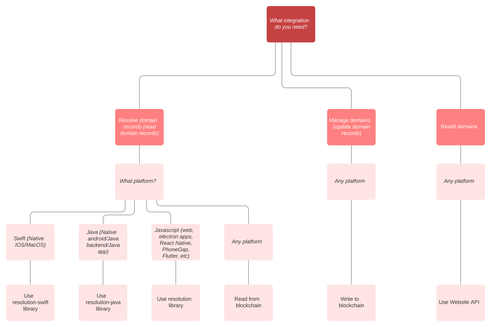

# Getting started

Unstoppable Domains supports developer integrations covering three main use cases. Those use cases are:

1. Domain resolution
2. Domain management
3. Domain reselling

In each case, it may be helpful to read through our [Website API reference](https://apidocs.unstoppabledomains.com/).

## Domain resolution

Domain Resolution allows developers to translate a `.crypto` or `.zil` domain name into addresses for BTC, ETH, IPFS, and more. Domain Resolution can \(and we believe, should\) be used anywhere your application has a "Send to: " field.

To make domain resolution easier, we've written libraries for web, Android, and iOS.

### Domain resolution libraries

* [JavaScript resolution library](https://github.com/unstoppabledomains/resolution)
* [Java resolution library](https://github.com/unstoppabledomains/resolution-java)
* [Swift resolution library](https://github.com/unstoppabledomains/resolution-swift)

### Access domain metadata directly

If you're familiar with blockchain development and would rather avoid an additional dependency in your application, you can also read domain metadata directly.

* [Resolve .crypto without libraries](https://medium.com/unstoppabledomains/how-to-resolve-crypto-domain-names-82046db0404a)
* [Resolve .zil without libraries](https://medium.com/unstoppabledomains/how-to-resolve-zil-domain-names-f43da8fe37a9)
* [Resolving domain records](../domain-registry-essentials/resolving-domain-records.md)
* [Smart contracts reference](../domain-registry-essentials/cns-smart-contracts.md)
* [Records reference](../domain-registry-essentials/records-reference.md)

## Domain management

Editing domain metadata can be done manually by a direct connection with the appropriate blockchain. We strongly recommend prior experience with blockchain development before starting this type of integration.

* [Smart contracts reference](../domain-registry-essentials/cns-smart-contracts.md)
* [Managing domain records](../managing-domains/managing-domain-records.md)
* [Managing domain ownership](../managing-domains/managing-domain-ownership.md)

MyEtherWallet has implemented domain management and can be used as a reference implementation.

* [MyEtherWallet code reference](https://github.com/MyEtherWallet/MyEtherWallet/tree/master/src/dapps/Unstoppable)    
* [MyEtherWallet website](https://www.myetherwallet.com)

## Domain reselling

If you want to resell domains, use our website API.

* [Website API reference](https://apidocs.unstoppabledomains.com/)

## Support

If you have any questions you can email support@unstoppabledomains.com or join our development-focused [Discord channel](https://discord.gg/b6ZVxSZ9Hn).

## Free advertising for integrated apps

Once your app has a working Unstoppable Domains integration, [register it here](https://unstoppabledomains.com/app-submission). Registered apps appear on the Unstoppable Domains [homepage](https://unstoppabledomains.com/) and [Applications](https://unstoppabledomains.com/apps) page — putting your app in front of tens of thousands of potential customers per day.

Also, every week we select a newly-integrated app to feature in the Unstoppable Update newsletter. This newsletter is delivered to straight into the inbox of ~100,000 crypto fanatics — all of whom could be new customers to grow your business.

